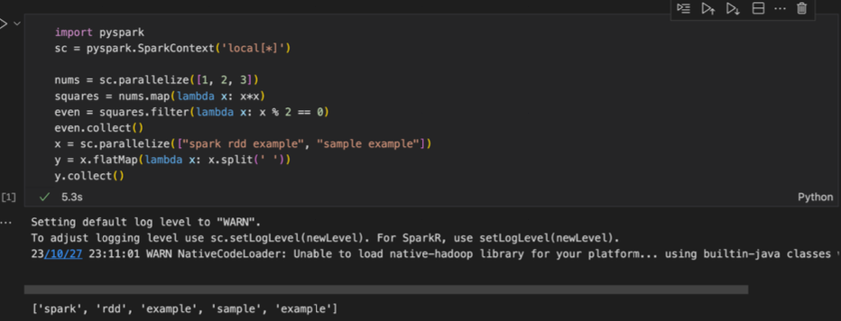
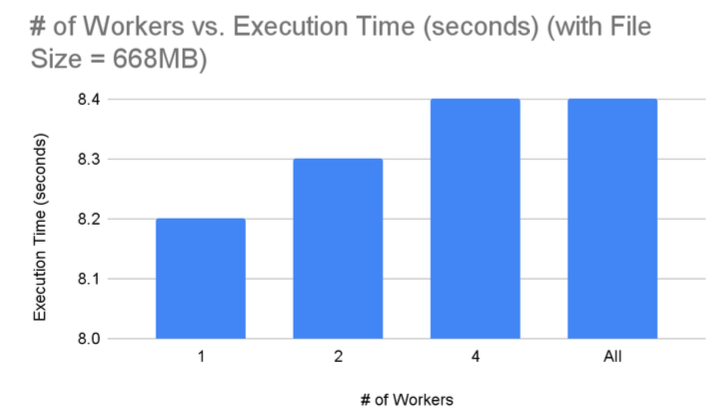
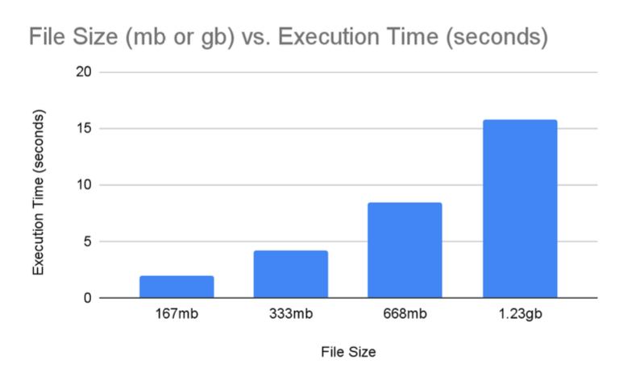
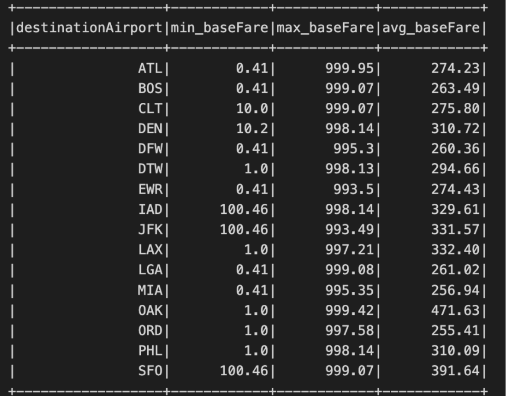
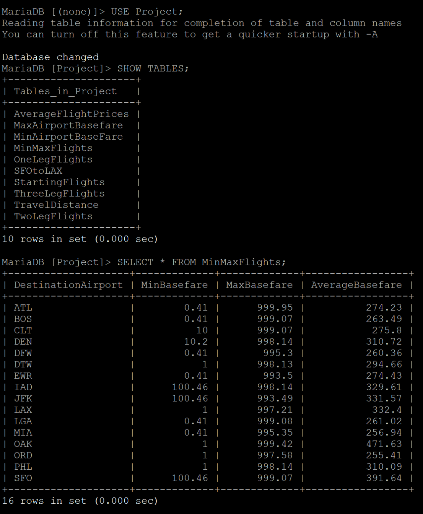
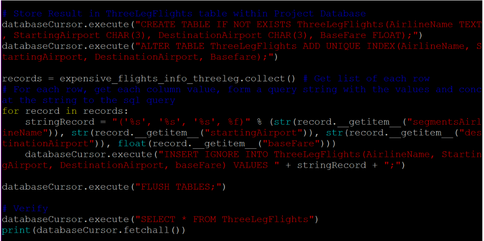
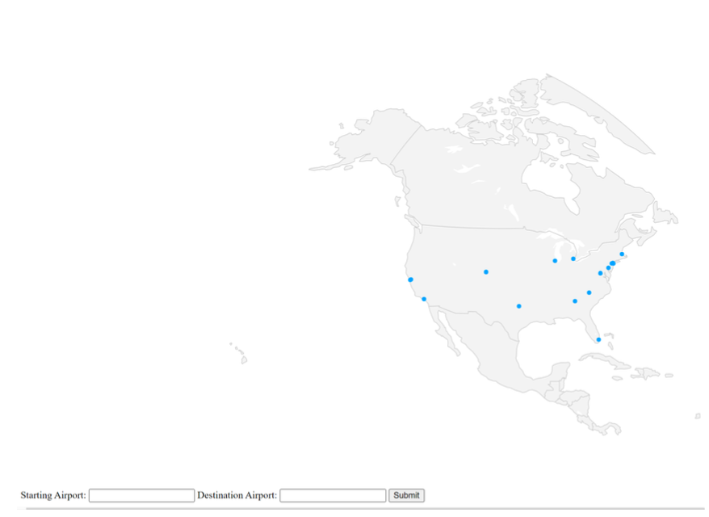
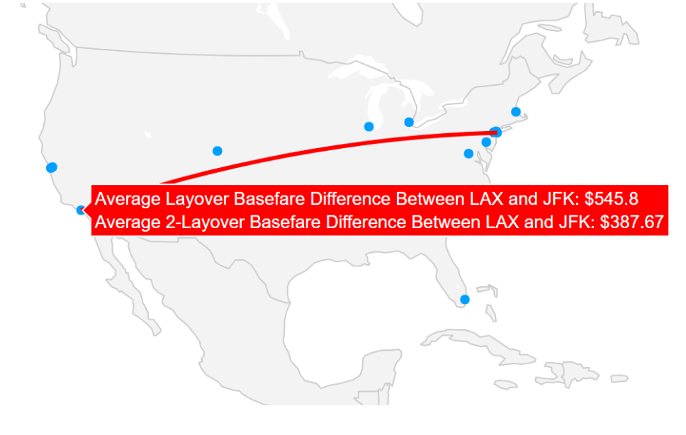

# Group 4 Final Report
# Trisha Agrawal, Isiah Montalvo, Dacia Rios
### Part 1
#### 1a. Project description. What is the goal of your analysis, and what do you expect to find? Any hypotheses?
Goal: Generate a map of the US that allows the user to discover flight routes, flight prices, and average duration of flights.

Hypothesis: What locations are the most popular and/or expensive during different times of the year?

What we expect to find: Holiday seasons contain the most popular and expensive flights.
#### 1b. Describe your data using a table (number of records, length of each record, number of attributes, and so on), a few example records, and a description of the data.
https://drive.google.com/u/2/uc?id=1ldsX73_EGclvF1CiDmDoHR004S2C1sdm&export=download
Variables  | Variables (continued)
------------- | -------------
legId (integer) | searchDate (YYYY-MM-DD)
flightDate (YYYY-MM-DD) | startingAirport (string)
destinationAirport (string) | fareBasisCode (string)
travelDuration (Loc+Hr+Min) | elapsedDays (integer)
isBasicEconomy (Bool) | isRefundable (Bool)
isNonStop (Bool) | baseFare (Float)
totalFare (Float) | seatsRemaining (integar)
totalTravelDistance (integer) | segmentsDepartureTimeEpochSecond(integer)
segmentsDepartureTimeRaw (Integer) | segmentsArrivalTimeEpochSeconds (integer)
segmentsArrivalTimeRaw (date+military time) | segmentsArrivalAirportCode (string)
segmentsDepartureAirportCode (string) | segmentsAirlineName (string)
segmentsAirlineCode (String) | segmentsEquipmentDescription (String)
segmentsDurationInSeconds (integer) | segmentsDistance (integer)
segmentsCabinCode (string)

Number of records: 1048575

Number of attributes / Length of each attribute: 27

Example records below:

The table below consists of three records. 7 out of the 27 columns were selected for this report. The table below shows three different flights on the same day, the same airport, and the same destination. Differing details include whether it is nonstop or not, the total fare, the number of seats remaining, and the total distance traveled.

flightDate  | startingAirport | destinationAirport | isNonStop | totalFare | seatsRemaining | totalTravelDistance
------------- | ------------- | ------------- | ------------- | ------------- | ------------- | -------------
2022-04-17 | ATL | BOS | True | 248.60 | 9 | 947
2022-04-17 | ATL | BOS | False | 251.10 | 3 | 956
2022-04-17 | ATL | BOS | False | 318.60 | 1 |1462

#### 1c. Run the following code on Spark and show screenshots of the results.
```
nums = sc.parallelize([1, 2, 3]);
squares = nums.map(lambda x: x*x);
even = squares.filter(lambda x: x % 2 == 0) ;
even.collect();
x = sc.parallelize(["spark rdd example", "sample example"]); y = x.flatMap(lambda x: x.split(' '));
y.collect();
```

Screenshots:



### Part 2
#### Requirements
For our project, we want to:
* Analyze and present the average prices of flights during a 4-month period, grouped by
airlines
* Explore average flight durations
* Determine the number of flights between specific locations to aid in route selection.
* Look at flight popularity based on the number of seats still available
* Calculate the average number of nonstop flights between locations

#### Design
Necessary PySpark operations:
```
import pyspark
from pyspark.sql import SparkSession
from pyspark.sql.functions import avg, max, min, month, year,
format_number, col, count, round
```
#### Implementation
This section involves snippets of various PySpark queries and an explanation of which PySpark operations were used to run the query successfully.

The code chunk below shows how SparkSession imported from pyspark.sql was used in this project. It was used to start a SparkSession and the master argument can be used to change the number of PySpark workers.
```
 # change number of workers in master argument below (1,2,4,*)
spark = SparkSession.builder \
    .config("spark.jars", "/usr/share/java/mysql-connector-j-8.0.31.jar") \
    .master("local[*]").appName("AirportQueries").getOrCreate()
```
The code chunk below shows how format_number is used to adjust the baseFare column to contain two digits after the decimal point. This formatting change was necessary because it is a column representing currency.
```
 # group by startingAirport and find the average baseFare
avg_flight_prices = data_filtered.groupBy("startingAirport") \
    .agg(format_number(avg("baseFare"), 2).alias("average_baseFare"))
```
The code chunk below shows how avg is used to determine the average baseFare for the given locations.
```
average_basefare = data.filter((data.startingAirport == 'SFO') &
(data.destinationAirport == 'LAX'))\
    .select(avg(data.baseFare).alias('average_baseFare'))
```
The code chunk below shows how GroupBy, round, avg, and cast were used to determine the average number of flights per day for each starting airport. Casting to integer was necessary for this operation because number of flights is a discrete numerical value. GroupBy is used in nearly every query in order to sort by starting or destination airport.
```
# average number of flights per starting airport
avg_flights_per_day = data.groupBy("startingAirport", "flightDate")\
.agg(count("legId").alias("numFlightsPerDay")).\
groupBy("startingAirport").agg(round(avg("numFlightsPerDay"))\
.cast("integer").alias("avgFlightsPerDay"))
```
The code chunk below shows how PySpark operations max and collect were used to determine the destination airports with the highest baseFare. The collect operation retrieves values of a DataFrame or RDD (Resilient Distributed Dataset), and the [0][0] indexes the first value to find the highest value.
```
# destination(s) with the highest baseFare
max_expensive_destinations =
max_basefare_per_destination.filter(max_basefare_per_destination.max_
baseFare ==
max_basefare_per_destination.agg(max("max_baseFare")).collect()[0][0])
```
The code chunk below shows the PySpark operations cast, month, and year being used in the first part of this query to filter flights by month. The purpose of this query was to determine the average base fare during the summer months.
```
# convert 'flightDate' column type to date
data = data.withColumn('flightDate', data['flightDate'].cast('date'))
# filter flights for June, July, August (summer months) in 2022
data_filtered = data.filter((month(data.flightDate).isin(6, 7, 8)) &
(year(data.flightDate) == 2022))
```
The code chunk below shows how the PySpark operation col is used to extract values from a column. The first part of this query shown below filters out flights that only involve one leg. In the dataset that we are using, flights with multiple legs or layovers consist of ‘||’ in the segmentsAirlineName column. In this query specifically, ‘~’ was used to find rows that do not contain ‘||’ or flights that do not involve layovers.
```
# filter out one leg flights only
filtered_data_oneleg =
data.filter(~col("segmentsAirlineName").contains("||"))
```
#### Visualizations
The following query was used for these graphs:
```
 # convert 'flightDate' column type to date
data = data.withColumn('flightDate', data['flightDate'].cast('date'))
# filter flights for June, July, August (summer months) in 2022
data_filtered = data.filter((month(data.flightDate).isin(6, 7, 8)) &
(year(data.flightDate) == 2022))
# group by startingAirport and find the average baseFare
avg_flight_prices = data_filtered.groupBy("startingAirport") \
    .agg(format_number(avg("baseFare"), 2).alias("average_baseFare"))
# result
avg_flight_prices.show()
```


Graph 1: # of Workers vs. Execution Time in seconds with a fixed dataset size. 

Analysis: As the number of workers increases, the execution time increases.



Graph 2: File Size in mb or gb vs. Execution Time in seconds.

Analysis: As the file size increases, the execution time for the given query also increases.

#### Output From PySpark Code (668 mb dataset)

Query #1: For each destination airport, this query finds the lowest, highest, and average baseFare in the dataset.
```
 # group by destinationAirport, find the min, max, average baseFare
max_expensive_destinations =
data.groupBy("destinationAirport").agg(min("baseFare").alias("min_baseFare"
), \
    max("baseFare").alias("max_baseFare"),
format_number(avg("baseFare"),2).alias("avg_baseFare"))
# show the result
max_expensive_destinations.show()
 ```


Query #2: This query first filters out flights that only have one leg, or no layovers. Then the most expensive flight, with the starting and destination airport is found.
```
# filter out one leg flights only
filtered_data = data.filter(~col("segmentsAirlineName").contains("||"))
# find the most expensive flight, grouped by airline name
most_expensive_per_airline = filtered_data.groupBy("segmentsAirlineName") \
    .agg(max("baseFare").alias("maxBaseFare"))
# retrieve the rows with the highest baseFare for each airline and remove
duplicates
expensive_flights_info =
filtered_data.join(most_expensive_per_airline.withColumnRenamed("segmentsAi
rlineName", "max_segmentsAirlineName"), (filtered_data.baseFare ==
most_expensive_per_airline.maxBaseFare) &(filtered_data.segmentsAirlineName
== most_expensive_per_airline.segmentsAirlineName), "inner") \
    .select("segmentsAirlineName", "startingAirport", "destinationAirport",
"baseFare").dropDuplicates(["segmentsAirlineName"])
# show the result
expensive_flights_info.show()
 ```


#### MYSQL Database Implementation:


#### Framework for storing PySpark queries:


### Part 3
#### Requirements
For this part of our project, this is what we want to achieve:
* Using Django, create a website that displays a map.
* This map would have nodes for each of the 13 airports that are in the dataset.
* When selecting two airports, the average price of direct flights and flights with layovers would be displayed on the screen from queries that were written in PySpark with the data stored in MySQL.

#### Design
Necessary functions that were imported:
```
import plotly.graph_objects as go
import pandas as pd
from pathlib import Path
import pyspark
from pyspark.sql import SparkSession
import time
import mysql.connector
import os
import sys
from django.core.asgi import get_asgi_application
from django.contrib import admin
from django.urls import include, path
from django.core.wsgi import get_wsgi_application
```
#### Implementation
This section will explain how the various functions that were imported were used throughout the project.
The code chunk below configures the Django project to use 'missionSite.settings' as the default settings module by employing the os.environ.setdefault method. Then, it initializes the ASGI (Asynchronous Server Gateway Interface) application using the get_asgi_application() function, preparing the Django project for asynchronous communication.
```
os.environ.setdefault('DJANGO_SETTINGS_MODULE',
'missionSite.settings')
application = get_asgi_application()
```
The code chunk below defines the BASE_DIR variable by resolving the absolute path of the current file's parent directory, which is two levels above, using the Path(__file__).resolve().parent.parent syntax.
```
 # Build paths inside the project like this: BASE_DIR / 'subdir'.
BASE_DIR = Path(__file__).resolve().parent.parent
```
This code defines the urlpatterns variable, a list of URL patterns in a Django project. It includes paths for the admin interface at '/admin/' and routes related to the 'mission' app using include('mission.urls').
```
urlpatterns = [
    path('admin/', admin.site.urls),
    path('mission/', include('mission.urls')),
]
```
The code chunk below sets the default Django settings module to 'missionSite.settings' using the os.environ.setdefault method and then initializes the WSGI (Web Server Gateway Interface) application using the get_wsgi_application() function, preparing the Django project for deployment with a WSGI server.
```
os.environ.setdefault('DJANGO_SETTINGS_MODULE',
'missionSite.settings')
application = get_wsgi_application()
```
Following the previous code chunk, the line below executes the Django command line based on the arguments passed in sys.argv, facilitating the command-line interaction and management of the Django project.
```
execute_from_command_line(sys.argv)
```
The line below creates a new Plotly figure object, fig, providing a canvas for generating interactive visualizations. The go.Figure() function call is a common entry point in Plotly for constructing plots in Python.
```
fig = go.Figure()
```
#### Front-End Technology
While building this website, Django, a web development framework, is used to organize and structure the project. The first code chunk mentioned above configures Django to use specific project settings and initializes it for handling simultaneous communication. Additionally, the project's directory structure is established, systematically organizing files and paths. The website's different sections and pages are defined in a straightforward manner using Django's URL routing system, ensuring users are directed to the correct content.
For deployment, Django is set up to work with a Web Server Gateway Interface (WSGI), which facilitates the smooth deployment of the website on servers. Command-line operations are utilized to manage the project efficiently, enabling tasks like starting the development server or applying updates to the website.
Plotly is used to present the map in a way that is interactive and presentable to the user. Through this, a map of North America is presented on the website with points plotted to represent airports. A user input feature was added to the visualization to present the user with information when entering two airports. These buttons are presenting at the bottom of the page, which can be found by scrolling all the way down.

#### MYSQL Database Implementation:
There are ten tables stored in MySQL that contain information obtained from running ten PySpark queries on our dataset. Each table that is stored in MySQL has different columns based on what kind of information the query is extracting or calculating. The ten tables are AverageFlightPrices, MaxAirportBaseFare, MinAirportBaseFare, MinMaxFlights, OneLegFlights, SFOtoLAX, ThreeLegFlights, TravelDistance, TwoLegFlights.
Some examples of columns that are stored in MySQL that come directly from the original dataset are startingAirport, destinationAirpo, segmentsAirLine, and baseFare.
Some examples of columns that are stored in MySQL that are calculated when a PySpark query is run are average_baseFare, avgFlightsPerDay, avgCost, max_baseFare, and min_baseFare.
 
The code chunk below shows how data is being stored in MySQL after a PySpark query has been executed. This is an example for one of the queries.
```
 # Store Result in AverageBasefare table within Project Database
databaseCursor.execute("CREATE TABLE IF NOT EXISTS
AverageFlightPrices(StartingAirport CHAR(3), AverageBasefare
FLOAT);")
databaseCursor.execute("ALTER TABLE AverageFlightPrices ADD UNIQUE
INDEX(StartingAirport, AverageBasefare);")
records = avg_flight_prices.collect() # Get list of each row
# For each row, get each column value, form a query string with the
values, and concat the string to the SQL query
for record in records:
    stringRecord = "('%s', %f)" %
(str(record.__getitem__("startingAirport")),
float(record.__getitem__("average_baseFare")))
    databaseCursor.execute("INSERT IGNORE INTO
AverageFlightPrices(StartingAirport, AverageBasefare) VALUES " +
stringRecord + ";")

databaseCursor.execute("FLUSH TABLES;")
```

#### Submitting a Query
For the user to submit a query, they have to input two airports in the input boxes at the bottom of the page. The user is prompted to enter a starting and destination airport. Once “Submit” is pressed, the average layover and 2-layover basefire flights

In this code chunk, user input is being collected as the starting and destination airport. HTML is used to render the buttons for these two input values.
```
 if request.method == "POST":
        start = request.POST.get("stAir", None)
        dest = request.POST.get("endAir", None)
        print(start)
        print(dest)
```
The code chunk below shows how the value the user inputs “start” and “dest” are used to extract data from the query that has already been stored in MySQL.
```
if (((finalDF["StartingAirport"].eq(start)).any() == True) and
((finalDF["StartingAirport"].eq(dest)).any() == True)):
        query1l = pd.read_sql("SELECT BaseFare FROM TwoLegFlights
WHERE StartingAirport = '%s' AND DestinationAirport = '%s'" % (start,
dest), dbConnection)
        query2l = pd.read_sql("SELECT BaseFare FROM ThreeLegFlights
WHERE StartingAirport = '%s' AND DestinationAirport = '%s'" % (start,
dest), dbConnection)
        difference1 = finalDF[finalDF["StartingAirport"] == start]
        difference1 = finalDF["OneLayoverDifference"].iloc[0]
        difference2 = finalDF[finalDF["StartingAirport"] == dest]
        difference2 = finalDF["TwoLayoverDifference"].iloc[0]
        startdf = df_airports[df_airports["iata"] == start]
        destdf = df_airports[df_airports["iata"] == dest]
        fig.add_trace(go.Scattergeo(
            locationmode = 'USA-states',
            lon = [startdf['long'].iloc[0], destdf['long'].iloc[0]],
            lat = [startdf['lat'].iloc[0], destdf['lat'].iloc[0]],
            hoverinfo = 'text',
            text = "Average Layover Basefare Difference Between " +
start + " and " + dest + ": $" + difference1 + "<br>" + "Average
2-Layover Basefare Difference Between " + start + " and " + dest + ":
$" + difference2,
            mode = 'lines',
            line = dict(width = 3, color = 'red')
        ))
```
#### Screenshots
Commands to run code and open website:
NOTE: Have a db file prepared before running these commands.
```
conda activate mission2
cd project/projectSite/missionSite/
python3 manage.py runserver 0.0.0.0:8080
```

Open the website in this link: http://cs179g-fall-2023-04.cs.ucr.edu:8080/mission/
How the map appears on the website, there are two input boxes at the bottom:



How the map presents information after selecting starting and destination airport:



